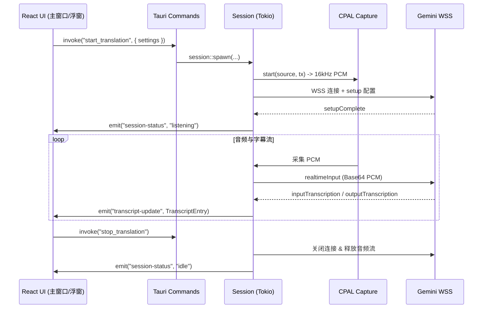

# Live Translator

基于 **Tauri v2** + **React 19** + **TypeScript** + **Rust** 的跨平台实时字幕翻译桌面应用，通过 **Gemini Live Translate** 进行实时双向流式语音识别与翻译。

---

## 1. 模块结构

```text
live-translator/
├── src/                       # React 19 前端 (TypeScript + Vite)
│   ├── App.tsx                # 根组件（按 URL 参数分流主窗口/字幕浮窗）
│   ├── types.ts               # 前后端共享数据模型与默认配置
│   ├── components/            # UI 组件 (BrandHeader, ControlBar, TranscriptPanel, CaptionWindow, SettingsDialog)
│   ├── hooks/                 # 自定义 Hooks (useTranslator, useTheme)
│   ├── lib/                   # 工具函数 (runtime, transcript, transcriptActions, windows)
│   └── styles/                # CSS 样式 (app.css, base.css, main.css, caption.css)
└── src-tauri/src/             # Rust 后端
    ├── lib.rs / main.rs       # Tauri 应用入口、插件注册与窗口生命周期管理
    ├── models.rs              # 核心数据结构 (AppSettings, AudioSource, TranscriptEntry 等)
    ├── commands.rs            # Tauri IPC 命令 (配置、凭据、翻译会话控制)
    ├── windows.rs             # 独立无边框字幕浮窗管理与联动退出
    ├── session.rs             # 翻译会话管理 (Tokio 线程、重连循环)
    ├── settings.rs            # JSON 配置读写 (`app_config_dir`) 与字幕导出
    ├── credentials.rs         # Keyring 系统凭据存储 (`GEMINI_API_KEY` fallback)
    ├── network/proxy.rs       # 系统代理嗅探 (`sysproxy`) 与 HTTP CONNECT TLS 隧道
    ├── audio/                 # 音频捕获 (WASAPI loopback/Mic)、重采样至 16kHz、混音与回放
    └── gemini/                # Gemini WebSocket (`gemini-3.5-live-translate-preview`) 与字幕累加器
```

---

## 2. 核心架构与数据流



### 关键通信协议

- **Tauri IPC 命令**：`get_settings`, `save_settings`, `get_api_key_status`, `save_api_key`, `start_translation`, `stop_translation`, `open_caption_window`, `close_caption_window`, `export_transcript`。
- **全局事件**：`session-status` (`idle|connecting|listening|stopping|error`), `transcript-update`, `settings-update`, `transcript-clear`。
- **Gemini WebSocket**：
  - 端点：`wss://generativelanguage.googleapis.com/ws/google.ai.generativelanguage.v1beta.GenerativeService.BidiGenerateContent?key=...`
  - 模型：`models/gemini-3.5-live-translate-preview`
  - 音频格式：`audio/pcm;rate=16000` (单声道 16-bit PCM)，语言代码映射（如 `zh-CN` -> `zh-Hans`）。

---

## 3. 开发、格式化与测试命令

> **包管理器规范**：本项目统一使用 `pnpm`，禁止使用 `npm`、`yarn` 或 `npx`。

| 操作 | 命令 | 说明 |
| :--- | :--- | :--- |
| **安装依赖** | `pnpm install` | 安装前端依赖 |
| **本地开发** | `pnpm tauri dev` | 启动开发服务器（前端 Vite + 后端 Rust） |
| **前端代码检查** | `pnpm oxlint` | 快速代码规范与 Lint 检查 |
| **前端格式化** | `pnpm oxfmt` | 格式化前端与工程文件（`--check` 仅检查） |
| **后端格式化** | `cargo fmt --manifest-path src-tauri/Cargo.toml` | 格式化 Rust 代码（`-- --check` 仅检查） |
| **前端构建** | `pnpm build` | TypeScript 类型检查 (`tsc`) + Vite 打包 |
| **后端语法检查** | `cargo check --manifest-path src-tauri/Cargo.toml` | 校验 Rust 代码与依赖 |
| **后端 Clippy 检查** | `cargo clippy --manifest-path src-tauri/Cargo.toml` | Rust 代码规范与 Lint 检查（必须 0 警告） |
| **后端测试** | `cargo test --manifest-path src-tauri/Cargo.toml` | 运行 Rust 单元测试（仅在核心/复杂逻辑变动时运行） |

---

## 4. AI Agent 编码准则

1. **凭据安全**：API Key 严禁写入 `settings.json` 或明文日志，必须通过 `credentials.rs` 存入系统 `keyring`。
2. **数据同步**：修改 `src-tauri/src/models.rs` 时必须同步更新 `src/types.ts`，字段保持 `snake_case`。
3. **跨平台兼容**：音频采集与网络代理需保持 Windows / macOS / Linux 适配与友好异常提示。
4. **禁止 Emoji**：整个仓库（包括代码、注释、提交信息、文档、UI 文本等所有地方）严禁使用任何 Emoji。
5. **Clippy 零警告与测试策略**：Clippy 视为标准告警，改动后必须保证 `cargo clippy` 完全干净。对于小型且确定的改动，避免运行 `cargo test` 以节约开销。
6. **代码修改后的标准验证链路**：
   ```bash
   pnpm oxfmt
   cargo fmt --manifest-path src-tauri/Cargo.toml
   pnpm oxlint
   pnpm build
   cargo check --manifest-path src-tauri/Cargo.toml
   cargo clippy --manifest-path src-tauri/Cargo.toml
   ```

---

## 5. Git 提交规范

Git 提交信息统一使用**简体中文**编写，遵循约定式提交（Conventional Commits）结构（常用 type 如 `feat`, `fix`, `chore`, `refactor`, `style`, `docs`, `perf`, `test` 等）：

```text
<type>: <简要描述>

<更详细的说明（如果需要）>
```
